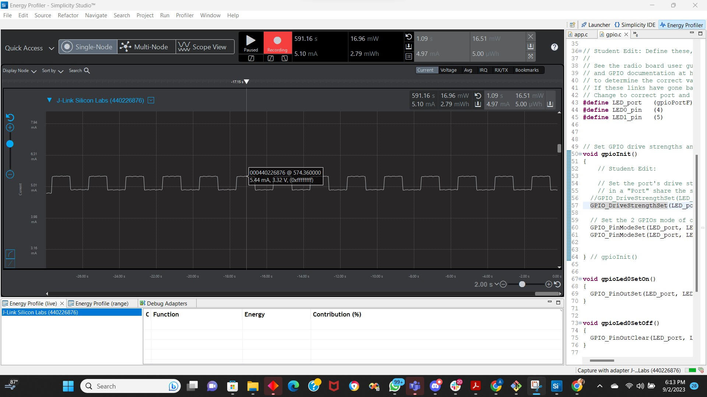

Please include your answers to the questions below with your submission, entering into the space below each question
See [Mastering Markdown](https://guides.github.com/features/mastering-markdown/) for github markdown formatting if desired.

**1. How much current does the system draw (instantaneous measurement) when a single LED is on with the GPIO pin set to StrongAlternateStrong?**
   Answer: 
   ON State: 5.42 mA
   
   
   OFF State: 4.88 mA
   

**2. How much current does the system draw (instantaneous measurement) when a single LED is on with the GPIO pin set to WeakAlternateWeak?**
   Answer:
   ON State: 5.44 mA
   

   OFF State: 4.94 mA
   

**3. Is there a meaningful difference in current between the answers for question 1 and 2? Please explain your answer, referencing the main board schematic, WSTK-Main-BRD4001A-A01-schematic.pdf, and AEM Accuracy in the ug279-brd4104a-user-guide.pdf. Both of these PDF files are available in the ECEN 5823 Student Public Folder in Google drive at: https://drive.google.com/drive/folders/1ACI8sUKakgpOLzwsGZkns3CQtc7r35bB?usp=sharing . Extra credit is available for this question and depends on your answer.**
   Answer: No, there is no meaningful difference in current between the answers for question 1 and 2. 
Resistors: Both LEDs have 3K ohm resistor in series. 
 

So, the maximum current for LED0 and LED1, with a 3k ohm series resistor and a 2V forward voltage drop, is approximately 0.0006667 amperes or 0.667 milliamperes (mA).

The AEM is capable of measuring currents in the range of 0.1 μA to 95 mA. For currents above 250 μA, the AEM is accurate within 0.1 mA. When measuring currents below 250 μA, the accuracy increases to 1 μA. Even though the absolute accuracy is 1 μA in the sub 250 μA range, the AEM is able to detect changes in the current consumption as small as 100 nA.
The AEM current sampling rate is 10 kHz.

 

4.61 mA is the current when both LEDs are off.

StrongAlternateStrong:
High- 5.42 mA 		(0.81 mA through LED0)
Low- 4.88 mA		(0.27 mA through LED0)

WeakAlternateWeak:
High- 5.44 mA     (0.83 mA through LED0)
Low- 4.94 mA		(0.33 mA through LED0)

Because of the above reasons current won't go beyond it's limiting value that's why we see similar values in cases in Q1 nad Q2. The load is similar i.e. 3k ohm, thus does not need much current to drive that load. The drive strengths set (up to 10 mA, etc) does mean it can go to that much current however we do not need that much current for the load. 

**4. With the WeakAlternateWeak drive strength setting, what is the average current for 1 complete on-off cycle for 1 LED with an on-off duty cycle of 50% (approximately 1 sec on, 1 sec off)?**
   Answer: 5.16 mA
   

**5. With the WeakAlternateWeak drive strength setting, what is the average current for 1 complete on-off cycle for 2 LEDs (both on at the time same and both off at the same time) with an on-off duty cycle of 50% (approximately 1 sec on, 1 sec off)?**
   Answer: 5.20 mA
   

